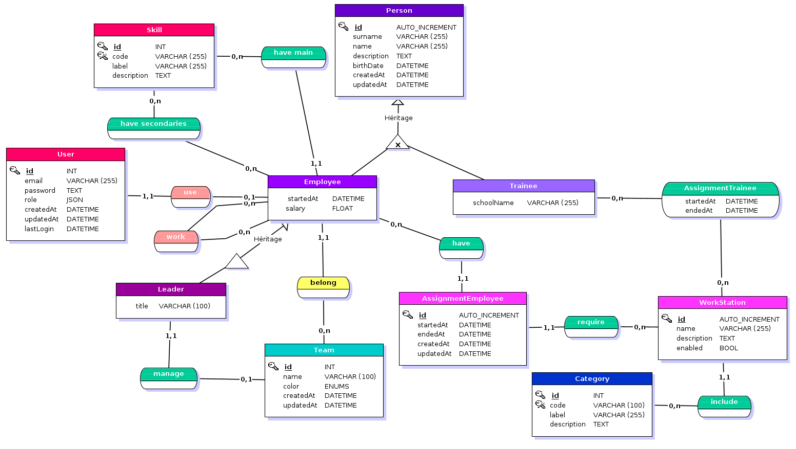

Societe R
===

1. add a new file `docker-compose.override.yaml`
```yaml
services:
    app:
        image: ${PROJECT_NAME}-app:latest
        build:
            context: .
            target: app
            args:
                GITLAB_TOKEN: ''
        environment:
            PHP_CS_FIXER_IGNORE_ENV: 1
            APP_ENV : dev
        volumes:
            - "./:/srv/app/"

    nginx:
        image: ${PROJECT_NAME}-nginx:latest
        volumes:
            - "./:/srv/app/"
        build:
            context: .
            target: nginx

    database:
        ports:
            - "8022:5432"

    mailer:
        container_name: "${PROJECT_NAME}-mailer"
        image: schickling/mailcatcher
        ports: [1025, 1080]
```

2. launch command `make build-up` to up project
3. Go to `http://localhost:8020`

# MCD
